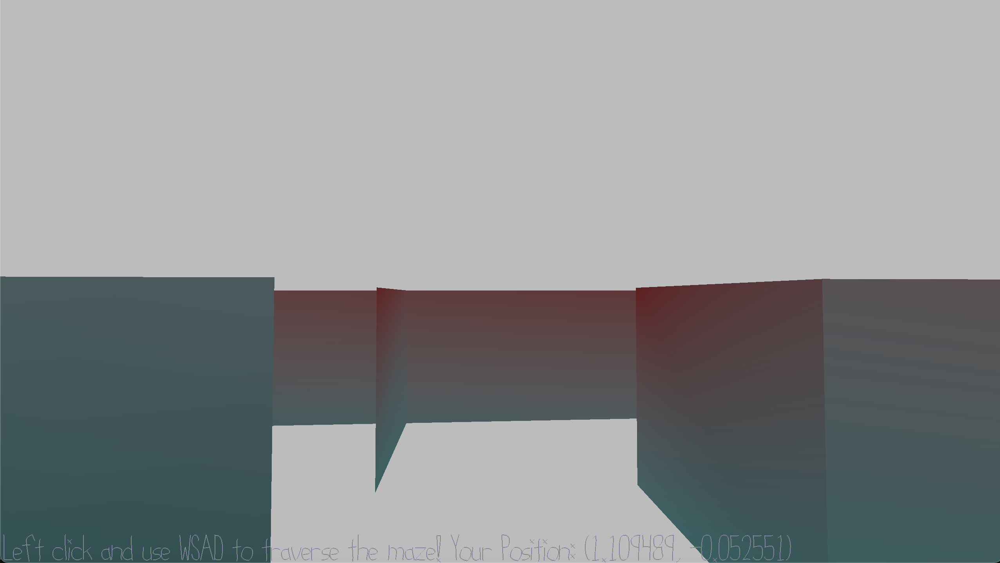

# The maze

Author: Dante Liang

Design: The game features a maze that shows the player's real time position and asks the player to get out. 

Screen Shot:

How To Play:

Left click and use WASD to walk around.

Sources: Maze is generated randomly from https://mazegenerator.net/.
Walk mesh code involved is adapted from Professor McCann in class.

This game was built with [NEST](NEST.md).

